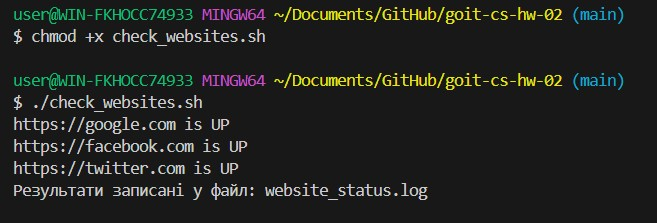
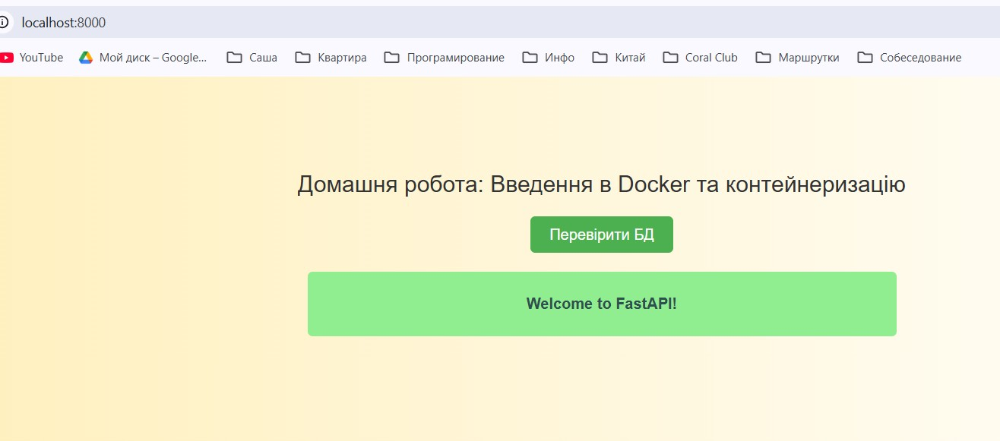

# goit-cs-hw-02

Завдання 1: Bash-скрипт для перевірки доступності сайтів
Створити check_websites.sh, який:

Перевіряє доступність сайтів зі списку.
Записує результати у файл логів.
Виводить повідомлення про завершення.

Запускаємо
chmod +x check_websites.sh

./check_websites.sh

Скріншот виконаного завдання

Завдання 2: Docker Compose для FastAPI + PostgreSQL
Тут потрібно:
Клонувати репозиторій.
Створити Dockerfile для FastAPI.
Написати docker-compose.yaml для запуску застосунку та БД.

git clone https://github.com/GoIT-Python-Web/Computer-Systems-hw02.git
cd Computer-Systems-hw02

Створюємо Dockerfile

Створюємо docker-compose.yaml

Змінюємо conf/db.py

SQLALCHEMY_DATABASE_URL = "postgresql+psycopg2://postgres:567234@db:5432/hw02"

Запускаємо Docker Compose
docker-compose up --build -d

Скріншот виконаного завдання

